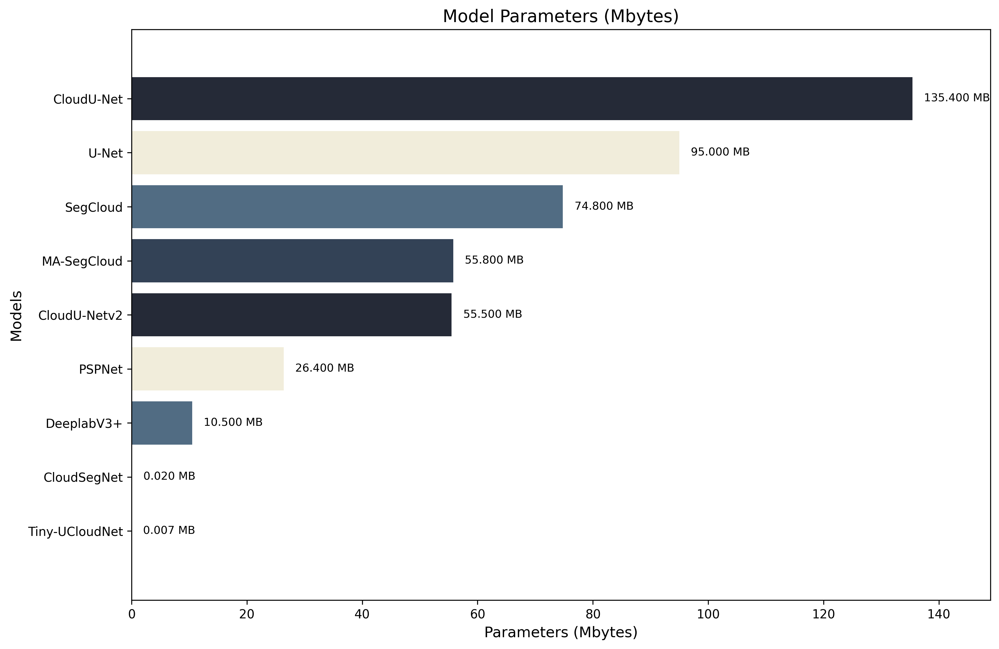
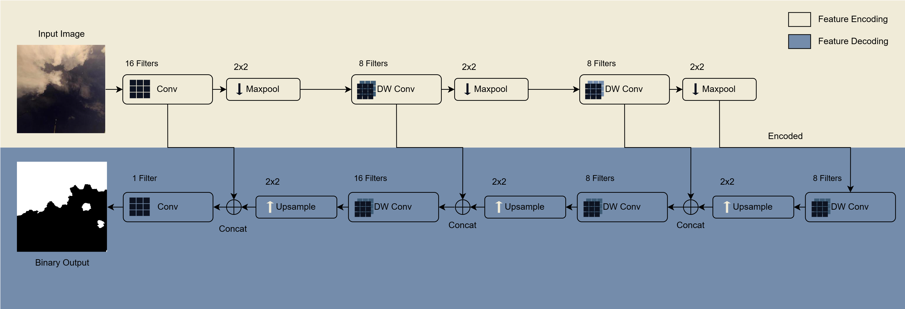

# 🌤️ TINY-UCLOUDNET: MEMORY EFFICIENT GROUND-BASED CLOUD SEGMENTATION NETWORK

**Authors:**  
Ifran Rahman Nijhum<sup>1,2</sup>, Md Shihab Reza<sup>3</sup>, Soumyabrata Dev<sup>1,2</sup>  
<sup>1</sup> The ADAPT SFI Research Centre, Dublin, Ireland  
<sup>2</sup> School of Computer Science, University College Dublin, Dublin, Ireland  
<sup>3</sup> Design Inclusion & Access Lab, Department of ECE, North South University, Dhaka, Bangladesh  

📧 ifran.nijhum@ucdconnect.ie | shihab.reza@northsouth.edu | soumyabrata.dev@ucd.ie  

---

## 🔎 Abstract
Ground-based sky images are widely used in meteorology and solar forecasting. However, existing deep-learning-based cloud segmentation models are computationally heavy and unsuitable for resource-constrained devices.  

We propose **Tiny-UCloudNet**, a novel **ultra-lightweight segmentation model** that leverages a simplified U-Net architecture with **depthwise separable convolutions**. Our model achieves:  

- **7 KB trainable parameters**  
- **2× smaller than CloudSegNet**  
- **1000× smaller than U-Net**  

Despite its compact size, Tiny-UCloudNet demonstrates **competitive performance** on benchmark day and nighttime cloud datasets, making it ideal for **deployment on edge devices**.  

---

## 📊 Model Comparison
**Comparison of model parameters for different architectures on a logarithmic scale**  

  

---

## 🏗️ Model Architecture
**Simplified U-Net based architecture with depthwise-separable convolutions**  

  

---

## 🚀 Key Features
- Ultra-lightweight design (**7 KB parameters**)  
- Depthwise separable convolutions for efficiency  
- Suitable for **remote and edge deployment**  
- Works for **both daytime and nighttime cloud images**  
- Benchmark-tested against **U-Net** and **CloudSegNet**  

---

## 📥 Installation & Usage
```bash
# Clone this repository
git clone https://github.com/your-username/Tiny-UCloudNet.git
cd Tiny-UCloudNet

# (Optional) Create a virtual environment
python3 -m venv tinyenv
source tinyenv/bin/activate  # On Windows: tinyenv\Scripts\activate

# Install requirements
pip install -r requirements.txt

# Train the model
python train.py --model_name TinyUCloudNet --dataset /path/to/dataset

# Test / inference
python test.py --model_name TinyUCloudNet --image /path/to/input_image.jpg

```
---

## 📖 Citation

If you use this work, please cite our IGARSS 2025 paper:

```bibtex
@inproceedings{nijhum2025tinyucloudnet,
  title     = {TINY-UCLOUDNET: Memory Efficient Ground-Based Cloud Segmentation Network},
  author    = {Nijhum, Ifran Rahman and Reza, Md Shihab and Dev, Soumyabrata},
  booktitle = {Proceedings of the 2025 IEEE International Geoscience and Remote Sensing Symposium (IGARSS)},
  year      = {2025},
  address   = {Brisbane, Australia},
  month     = {August},
  organization = {IEEE},
  note      = {DOI: to be added}
}

